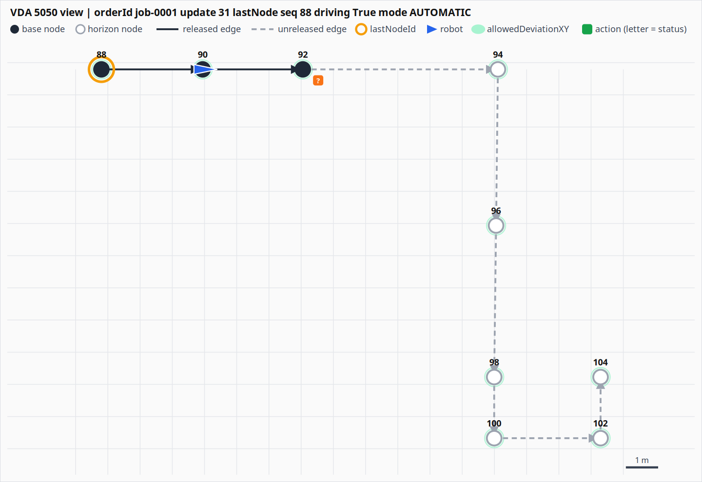

# vda5050 skill for Claude Code

[한국어](README.ko.md)

A Claude Code plugin that gives Claude an accurate, citable VDA 5050 reference while you build or debug
fleet-control / AMR integrations.

- Topic layout, header, QoS and retain rules
- Order semantics: base/horizon, stitching, acceptance decision tree, rejection error types, cancel
- State semantics: traversal, idle, operating modes, error levels, request/response
- Predefined actions, blocking types, action state machine
- 2.1 vs 3.0 differences and renames
- Official JSON schemas (2.1.0 and 3.0.0) and `scripts/validate.py` for schema + order-semantic checks

## Does it help? A small measurement

Four VDA 5050 3.0.0 fact questions, asked to Claude Code (Sonnet) from an empty directory, one to
three runs each. Without the plugin the model answers with 2.x names or invents values, because 3.0
(March 2026) is barely in training data.

| question | without plugin | with plugin |
|---|---|---|
| `connectionState` values | wrong (2.x list, no HIBERNATING) | correct |
| state position / battery field names | wrong (`agvPosition`, `batteryState`) | correct (`mobileRobotPosition`, `powerSupply`) |
| `blockingType` values | wrong (no SINGLE) | correct |
| errorType for an update to a cancelled order | invented (`orderUpdateError`) | correct (ORDER_UPDATE_FOLLOWING_CANCEL) |

Score: 0/4 without, 4/4 with. This is a smoke test, not a benchmark: it covers fact lookups only, not
the quality of generated orders or adapter code. The second row needed a description fix so the skill
triggers on simple lookups; the version in this repo includes that fix.

## Install

```
/plugin marketplace add Navifra-Sally/vda5050-skill
/plugin install vda5050@vda5050-skill
```

Or try it locally: `claude --plugin-dir ./vda5050-skill`.

Cursor, Codex CLI, OpenCode and other agents that read `SKILL.md` (via [skills.sh](https://skills.sh)):

```
npx skills add Navifra-Sally/vda5050-skill
```

## Draw an order or state

```
python3 skills/vda5050/scripts/render.py --order o.json --state s.json --vis v.json -o view.html
```

One self-contained HTML (or `.svg`), no JavaScript: nodes at their map positions with direction arrows,
base solid / horizon dashed, `allowedDeviationXY` ellipses, `lastNodeId` ring, robot position and
heading, action badges coloured by `actionStatus`, a 1 m grid, and below the picture the state header
and the validator findings.



In this example the robot (blue) sits just past node 90 heading for 92, whose `pick` action shows an
orange `?` because the captured state has no actionState for it. Source files and the HTML version are
in [`skills/vda5050/references/examples/`](skills/vda5050/references/examples/).

## Example prompts

**Write an order update**
> The robot is standing on node g with base f d g. Release b and h, add i as horizon. Give me the order update JSON for version 2.1.0.

Resends g as the first node with identical content, increments `orderUpdateId`, continues `sequenceId`,
keeps edges = nodes - 1, uses 2.1 field names, and validates the result with `validate.py order`.

**Diagnose a rejection**
> The state shows errors: OUTDATED_ORDER_UPDATE. Why?

Same `orderId` with an `orderUpdateId` lower than the one the robot holds. The previous order keeps
running and the WARNING stays until the next accepted order. Check resend logic that ignores the last
reported `orderUpdateId`.

**Re-issue after cancel**
> I cancelled mid-edge and the next order gets START_NODE_OUT_OF_RANGE.

The next order's first node must be a temporary node at the robot's current position or the last
traversed node with a widened `allowedDeviationXY`, and the `orderId` must be new.

**Decide how to implement charging**
> Should startCharging be an instant action or a node action?

Both are allowed. Completion is judged by `powerSupply.charging` (2.x: `batteryState.charging`).
Overcharge protection is the robot's responsibility.

**Write a 2.x <-> 3.0 adapter**
> Convert a 3.0 state message so my 2.1 parser can consume it.

Maps `mobileRobotPosition` -> `agvPosition`, `powerSupply` -> `batteryState`, `activeEmergencyStop` ->
`eStop`, `CONNECTION_BROKEN` -> `CONNECTIONBROKEN`, merges `instantActionStates` into `actionStates`,
and maps SINGLE and RETRIABLE.

**Build a simulated robot**
> Write a Python VDA5050 3.0 simulator that accepts orders, walks the nodes and publishes state.

Sets the retained CONNECTION_BROKEN last will before publishing retained ONLINE, QoS 1 only for
`connection`, state on every event plus every 30 s, removes the `nodeState` and updates `lastNodeId`
on traversal, never lists the first node in `nodeStates`.

**Reconstruct a timeline from an MQTT capture**
> From this capture, tell me when the robot accepted the order and when it finished.

Accepted = first state carrying the new `orderUpdateId`. Finished = `nodeStates` and `edgeStates`
empty with all `actionStates` FINISHED or FAILED. Tail reached = `lastNodeSequenceId` equals the last
released node.

## Validate a message

```
python3 skills/vda5050/scripts/validate.py order  my_order.json
python3 skills/vda5050/scripts/validate.py state  my_state.json --spec 2.1.0
```

## Licensing

Skill text and script: MIT (see LICENSE). JSON schemas under `skills/vda5050/references/schemas/` are
copyright Verband der Automobilindustrie, MIT (see `LICENSE-VDA5050.txt` there), taken from
https://github.com/VDA5050/VDA5050. The 3.0.0 set is from `main` at commit 0b2ae43 because the files
tagged 3.0.0 contain invalid JSON (upstream issue VDA5050/VDA5050#660).
